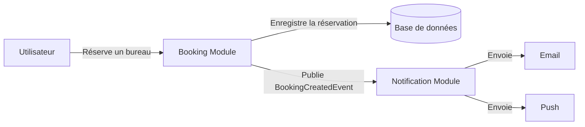
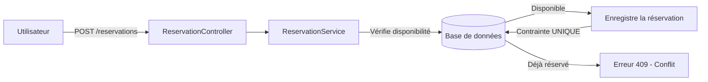
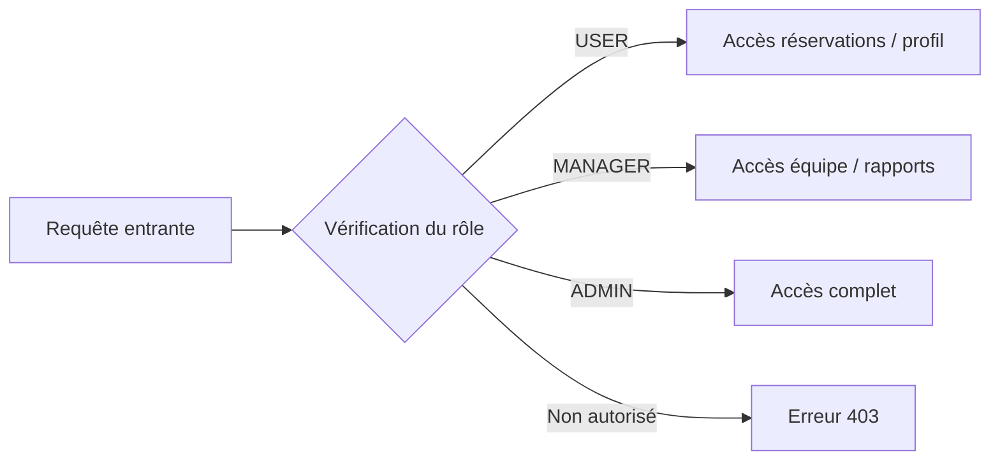

# Conception d'une application de gestion de bureau 

## Le problème de départ
L'application répond au besoin des entreprises modernes pratiquant le travail hybride. Elle permet aux collaborateurs d'organiser leur présence sur site et de réserver des postes de travail.

### Liste de fonctionnalités initiale 

Dans un premier temps, chaque membre du groupe a réfléchi individuellement aux fonctionnalités qui lui semblaient essentielles. On a ensuite mis nos idées en commun pour construire une liste consolidée. Certaines fonctionnalités ont été débattues ou écartées car jugées trop complexes pour le périmètre du projet. Voici ce qu'on a retenu :

- **Authentification & Sécurité**
  - Connexion sécurisée via email et mot de passe.
  - Procédure "Mot de passe oublié" avec envoi d'un lien sécurisé par email.
  - Gestion des sessions actives pour éviter les connexions multiples non autorisées.

- **Gestion du Profil**
  - Édition du profil personnel (photo, numéro de téléphone pro, biographie).
  - Configuration des préférences utilisateur (horaires par défaut, zones de bureau favorites).
  - Tableau de bord personnel avec vue d'ensemble des réservations et du solde de jours de télétravail.

- **Administration des Collaborateurs**
  - Création de nouveaux comptes par l'administrateur ou import via un fichier.
  - Envoi automatique d'un mail de bienvenue avec lien d'activation de compte.
  - Désactivation ou suppression des comptes lors du départ d'un employé.

- **Gestion des Droits et Rôles**
  - Affectation des utilisateurs aux rôles spécifiques (Employé, Manager ou Admin).
  - Restriction des fonctionnalités et contrôle d'accès selon le rôle défini.

- **Cartographie** : Visualisation interactive des plans (étages, zones de silence, open-space) et disponibilité en temps réel.
- **Réservations** : Système de réservation de poste avec sélection sur plan, modification et annulation instantanée.
- **Télétravail** : Calendrier de déclaration des jours de télétravail avec système de validation automatique.
- **Collaboration** : Moteur de recherche pour localiser un collègue dans les locaux.
- **Analytique** : Génération de rapports et statistiques d'occupation des locaux (réservé aux RH/Admin).
- **Notifications** : Système d'alertes automatiques (Push/Email) pour confirmer une réservation ou rappeler une présence.

### Étape 1 — Regrouper par domaines métier

| Module | Fonctionnalités incluses | Responsabilité |
| :--- | :--- | :--- |
| **User Module** | Inscription, connexion, gestion des profils, attribution des rôles (Admin, Manager, User). | Gère l'identité numérique des collaborateurs et définit leurs permissions. |
| **Space Module** | Inventaire des bâtiments, étages et postes de travail. | Gère la base de données physique des ressources disponibles dans l'entreprise. |
| **Booking Module** | Réservation de poste, déclaration de télétravail, annulations. | Gère le cycle de vie des réservations et garantit l'absence de conflits (ex: deux personnes sur le même bureau). |
| **Social Module** | Annuaire interne, localisation des collègues sur le plan, vue d'équipe. | Facilite la collaboration hybride en permettant de savoir qui est présent et où se placer pour être avec son équipe. |
| **Notification Module** | Rappels automatiques, confirmations par email, alertes push sur mobile. | Centralise la communication sortante du système pour informer les utilisateurs en temps réel. |

### Étape 2 — Identifier les entités métier

En parcourant la liste de fonctionnalités, on a essayé d'identifier les éléments centraux que l'application allait manipuler. Trois entités principales ont rapidement émergé :

**User (l'employé ou l'administrateur)**

**Workspace (le bureau ou la salle à réserver)**

**Booking (la réservation en elle-même)**


Chaque fonctionnalité influence directement la structure de nos entités. Par exemple :

> **Fonctionnalité :** "Déclarer ses jours de télétravail ou réserver un bureau pour la journée."
> → La réservation (Booking) doit donc avoir un type (Présentiel ou Télétravail) et une période. On en déduit :


'

## Étape 3 — Dériver les composants techniques

Une fois les entités identifiées, on a réfléchi à comment les traduire concrètement en code. On a suivi une architecture en couches classique en Spring Boot:  

**Controller → Service → Repository → Base de données**

---

## Exemple : “Réserver un bureau”

---

## 1. Interface d'entrée (Controller)

Le controller reçoit la requête HTTP et la transmet au service métier.

### Endpoint 
POST /reservations


### Code
```java
@RestController
@RequestMapping("/reservations")
class ReservationController {

    private final ReservationService reservationService;

    @PostMapping
    public Reservation createReservation(@RequestBody ReservationRequest request) {
        return reservationService.createReservation(request);
    }
}
```

## 2. Logique métier (Service)

Le service applique les règles métier :

- validation de la date  
- vérification de disponibilité  
- création de la réservation  

```java
@Service
class ReservationService {

    private final ReservationRepository reservationRepository;

    public Reservation createReservation(ReservationRequest request) {

        // 1. Vérifier que la date n'est pas dans le passé
        if (request.date.isBefore(LocalDate.now())) {
            throw new RuntimeException("Date invalide");
        }

        // 2. Vérifier la disponibilité du bureau
        boolean exists = reservationRepository.existsByEspaceIdAndDateAndPeriode(
                request.espaceId,
                request.date,
                request.periode
        );

        if (exists) {
            throw new RuntimeException("Ce bureau est déjà réservé");
        }

        // 3. Construire l'entité
        Reservation reservation = new Reservation();
        reservation.setDate(request.date);
        reservation.setPeriode(request.periode);
        reservation.setType(request.type);

        // 4. Sauvegarder en base
        return reservationRepository.save(reservation);
    }
}
```

## 3. Persistance (Repository)

Le repository gère l'accès à la base de données.
```java

@Repository
interface ReservationRepository extends JpaRepository<Reservation, Long> {

    boolean existsByEspaceIdAndDateAndPeriode(
            Long espaceId,
            LocalDate date,
            PeriodeReservation periode
    );
}
```
## 4. Règle métier importante

Pour garantir l’absence de conflits :

```sql
UNIQUE (espace_id, date, periode)
```

C'est l'exemple qu'on a le plus détaillé car c'est le cœur de l'application — tout le reste en dépend. Les deux exemples suivants suivent la même logique, on les présente donc de manière plus condensée

## Exemple 2 : “Gestion des comptes”

---

## 1. Interface d'entrée (Controller)

Le controller reçoit la requête HTTP et la transmet au service métier.

### Endpoints
POST /users  
POST /login  
PUT /users/{id}

---

## 2. Logique métier (Service)

Le service applique les règles métier :

- vérifier que l’email est unique  
- valider le mot de passe (longueur, sécurité)  
- gérer les rôles (User, Manager, Admin)  
- vérifier les identifiants lors de la connexion  
- permettre la mise à jour du profil  

---

## 3. Persistance (Repository)

Le repository gère l'accès à la base de données :

- enregistrer les utilisateurs  
- récupérer un utilisateur par email (connexion)  
- mettre à jour les informations utilisateur  

---

## 4. Règle métier importante

Pour garantir l’unicité des comptes :

UNIQUE (email)

## Exemple 3 : “Gestion des espaces”

---

## 1. Interface d'entrée (Controller)

Le controller reçoit la requête HTTP et la transmet au service métier.

### Endpoints
POST /workspaces  
PUT /workspaces/{id}  
DELETE /workspaces/{id}  
GET /workspaces  

---


## 2. Logique métier (Service)

Le service applique les règles métier :

- vérifier que l’espace existe avant modification ou suppression  
- empêcher la suppression si l’espace est réservé  
- gérer la capacité (nombre de places)  
- associer les espaces à des étages ou zones  
- filtrer les espaces disponibles selon les réservations  

---

## 3. Persistance (Repository)

Le repository gère l'accès à la base de données :

- enregistrer les espaces  
- mettre à jour les informations des espaces  
- supprimer un espace  
- récupérer la liste des espaces  
- filtrer les espaces disponibles  

---

## 4. Règle métier importante

Pour garantir la cohérence des données :

- Un espace ne peut pas être supprimé s’il existe des réservations actives  
- Chaque espace doit avoir une capacité > 0

Ce découpage nous a aussi aidés à mieux répartir le travail dans le groupe — chacun pouvait travailler sur une couche sans bloquer les autres.

.png>)'


## Étape 4 — Les fonctionnalités orientent les patterns

En avançant dans la conception, on s'est rendu compte que certaines fonctionnalités 
imposaient presque naturellement des choix techniques précis. Voici les trois cas 
qui ont le plus influencé notre architecture.

---

### Exemple 1 : Notifications après réservation

**Le besoin :** quand un utilisateur réserve un bureau, il doit recevoir une confirmation 
par email ou notification push.

**Le problème :** si on envoie la notification directement dans le même traitement que 
la réservation, l'utilisateur attend la fin de l'envoi avant d'avoir sa réponse. 
C'est lent, et si l'envoi échoue, ça peut faire rater toute la réservation.

**Notre choix :** on a séparé les deux actions. Le module Booking publie un événement 
`BookingCreatedEvent` dès que la réservation est confirmée. Le module Notification 
écoute cet événement et gère l'envoi de son côté, de manière indépendante.

Ce découplage nous a semblé naturel ici : la réservation et la notification n'ont pas 
de raison d'être dans le même bloc. Si demain on veut ajouter un SMS en plus de l'email, 
on n'a pas à toucher au module Booking.

BookingCreatedEvent  →  NotificationService  →  EmailSender / PushService

**Pattern utilisé :** Event-Driven (Observer)



---

### Exemple 2 : Anti-conflits de réservation

**Le besoin :** deux personnes ne peuvent pas réserver le même bureau au même moment.

**Le problème :** si deux utilisateurs envoient leur réservation en même temps, 
une simple vérification dans le code ne suffit pas — les deux requêtes peuvent 
passer la vérification avant que l'une des deux soit enregistrée.

**Notre choix :** on gère ça à deux niveaux :

1. Une vérification dans le service avant d'enregistrer :

```java
boolean exists = reservationRepository
    .existsByEspaceIdAndDateAndPeriode(
        request.espaceId,
        request.date,
        request.periode
    );

if (exists) {
    throw new RuntimeException("Ce bureau est déjà réservé");
}
```

2. Une contrainte directement en base de données :

```sql
UNIQUE (espace_id, date, periode)
```

Même si deux requêtes passent la vérification applicative en même temps, 
la base rejette la deuxième. On entoure l'opération d'une transaction pour 
garantir qu'aucun état intermédiaire incohérent ne soit sauvegardé.

**Pattern utilisé :** Transaction ACID + contrainte UNIQUE



---

### Exemple 3 : Gestion des rôles et permissions

**Le besoin :** toutes les fonctionnalités ne sont pas accessibles à tout le monde. 
Un employé ne peut pas gérer les espaces, un manager ne peut pas créer des comptes.

**Le problème :** si on gère les droits au cas par cas dans chaque endpoint, 
le code devient vite ingérable et les erreurs de sécurité faciles à introduire.

**Notre choix :** on centralise la gestion des droits dans une couche dédiée. 
Chaque utilisateur a un rôle (`USER`, `MANAGER`, `ADMIN`), et chaque endpoint 
déclare le rôle minimum requis pour y accéder. La vérification se fait 
automatiquement avant d'entrer dans la logique métier.

Requête entrante  →  Vérification du rôle  →  Accès autorisé ou refusé

Si demain on ajoute un nouveau rôle ou un nouvel endpoint, on n'a qu'un seul 
endroit à modifier.
On reviendra plus en détail sur l'implémentation des rôles dans la section 
dédiée à la gestion des droits. Ici on voulait surtout montrer pourquoi 
ce pattern s'imposait dès la conception.

**Pattern utilisé :** RBAC (Role-Based Access Control)



---

### Récapitulatif

| Fonctionnalité | Problème soulevé | Pattern retenu |
|---|---|---|
| Notifications après réservation | Couplage fort, lenteur | Event-Driven (Observer) |
| Anti-conflits de réservation | Requêtes simultanées | Transaction ACID + UNIQUE |
| Gestion des rôles et permissions | Droits éparpillés dans le code | RBAC |

  
## Étape 5 — Les fonctionnalités influencent le modèle de données

Dans notre architecture en microservices, la donnée n'est plus centralisée dans une seule base. Pour garantir la performance et la fiabilité, nous avons appliqué les concepts des systèmes distribués (Théorème CAP, source de vérité, gestion de la latence) à nos fonctionnalités.

### 5.1 La méthode en 4 questions (Dérivation)
Nous appliquons la méthode systématique sur notre fonctionnalité critique : **"Marquer un bureau comme réservé"**.

| Question | Réponse pour FlexiSpace |
| :--- | :--- |
| **1. Quel module ?** | **Booking Module** |
| **2. Quelle donnée ?** | Entité `Reservation`, champ `statut` → `CONFIRMED` |
| **3. Quelle logique ?** | Règle anti-collision : impossible de réserver un bureau déjà pris. Déclenche un événement `BookingConfirmedEvent`. |
| **4. Quelle interaction ?** | Endpoint `POST /reservations` (API REST) + publication de l'événement dans le Message Broker. |

### 5.2 Propriété de la donnée et Source de Vérité
Dans un système distribué, il faut éviter les copies désynchronisées (anti-pattern). Nous avons défini une **source de vérité unique** pour chaque domaine métier :

| Donnée | Propriétaire (Source de vérité) | Comportement des autres modules |
| :--- | :--- | :--- |
| **Profil / Rôle employé** | **User Module** | Le *Booking Module* ne stocke que l'`userId`. Il interroge l'API User pour vérifier les droits avant une réservation. |
| **Inventaire des Bureaux** | **Space Module** | Le *Social Module* (Cartographie) lit l'inventaire. Le bureau ne doit jamais être supprimé s'il a des réservations actives. |
| **Réservations actives** | **Booking Module** | Publie des événements (`BookingCreated`). Le *Notification Module* écoute cet événement pour envoyer le mail, sans jamais stocker la réservation. |

### 5.3 Localisation des données, Latence et Cache
Pour garantir une expérience utilisateur fluide (faible latence), nous devons adapter la localisation des données selon les fonctionnalités :

* **Lecture de la Cartographie (Social Module) :** L'affichage du plan et de la position des collègues est lu des centaines de fois par jour. 
    * **Stratégie :** Mise en place d'un **Cache en mémoire (ex: Redis)** avec une stratégie *Cache-aside*.
    * **Gestion du cache périmé :** Pour éviter d'afficher un bureau libre alors qu'il vient d'être réservé, le *Social Module* écoute les événements du *Booking Module* pour faire une **invalidation par événement** instantanée.

### 5.4 Cohérence des données et Théorème CAP
En cas de partition réseau (panne entre nos microservices), le **Théorème CAP** nous oblige à choisir entre Cohérence (C) et Disponibilité (A). Nos choix diffèrent selon la criticité métier :

* **Le système de Réservation (Choix CP - Cohérence + Tolérance aux partitions) :**
    * *Raison :* Une incohérence ici signifierait un "surbooking" (deux collègues pour un même bureau). C'est inacceptable pour l'entreprise.
    * *Garantie :* Nous exigeons une **Cohérence forte**. Si la base de données de réservation subit une panne de réplication, le système refusera les nouvelles réservations (Erreur HTTP 503) plutôt que de risquer un doublon. Utilisation stricte de transactions ACID locales.

* **Le système d'Annuaire et Cartographie (Choix AP - Disponibilité + Tolérance aux partitions) :**
    * *Raison :* Si un employé cherche où est assis son collègue, une donnée périmée de 10 secondes n'est pas dramatique.
    * *Garantie :* Nous choisissons la **Cohérence éventuelle**. Même si la synchronisation avec le module de réservation est coupée (partition), la carte continuera de s'afficher et de répondre aux requêtes en utilisant les données en cache, garantissant ainsi une haute disponibilité.

### 5.5 Les relations et le modèle de base de données (Multiplicités)

Notre diagramme de classes UML (Étape 3) dicte directement la manière dont les tables SQL seront construites. Nous avons traduit nos cardinalités en relations de base de données :

* **La Composition stricte (1:N) : `Batiment` et `EspaceDeTravail`**
    * *Sur le schéma :* Le losange noir indique qu'un bâtiment contient plusieurs espaces (`*`), et qu'un espace appartient à un seul bâtiment (`1`).
    * *Traduction SQL :* La table `EspaceDeTravail` contiendra une clé étrangère `batiment_id` (NOT NULL). Si le bâtiment est supprimé, la base de données supprimera en cascade (CASCADE DELETE) tous les bureaux associés.

* **L'Association simple (1:N) : `Utilisateur` et `Reservation`**
    * *Sur le schéma :* Un utilisateur effectue plusieurs réservations (`*`), mais une réservation appartient à un seul utilisateur (`1`).
    * *Traduction SQL :* La table `Reservation` contiendra une clé étrangère `utilisateur_id` (NOT NULL).

* **L'Association conditionnelle (0..1 : N) : `EspaceDeTravail` et `Reservation`**
    * *Sur le schéma :* Une réservation concerne `0..1` espace de travail.
    * *Traduction SQL :* C'est un choix métier fort. La table `Reservation` possèdera une clé étrangère `espace_id`, mais celle-ci pourra être **NULL** (vide). Cela nous permet d'enregistrer les réservations de type `TELETRAVAIL` ou `ABSENCE` qui ne nécessitent pas de bureau physique.


## Pourquoi utiliser les microservices

- Permet de découper une application en services indépendants
- Améliore la scalabilité (chaque service peut évoluer séparément)
- Facilite la maintenance et les déploiements
- Augmente la résilience (une panne n’impacte pas tout le système)
- Permet d’utiliser différentes technologies selon les besoins

---

## Étape 6 — Architecture Microservices

.png>)'


Le système est découpé en plusieurs microservices indépendants communiquant de deux manières :

### Communication synchrone
Les services échangent via des appels REST (API Gateway ou service à service) :

### Communication asynchrone
Les événements métiers sont diffusés via un **Apache Kafka**.

Exemples d’événements :
- EventReervcree
- EvenReservCancelled
- UtilisateurCreeEvent

### Avantage
Cette approche permet de découpler les services et d’améliorer la scalabilité et la résilience du système.

